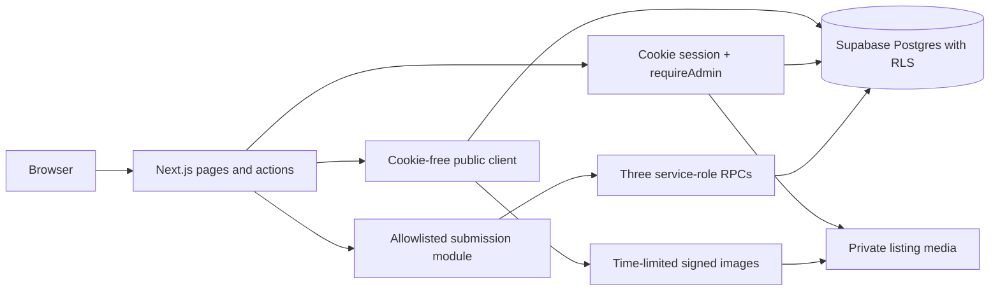

# Architecture

Next.js App Router serves public pages and server actions. Supabase Postgres is the source of truth; row-level security defines public listing visibility and admin access. Listing photos live in a private Storage bucket. The public app uses a cookie-free anon client for indexable reads and signed photo URLs.

Public enquiry, property request, report and contact-event requests pass through server-side validation and an allowlisted service-role RPC module. The service key is never imported by page components or sent to the browser. Admin routes call `requireAdmin`, which verifies the signed-in user with Supabase Auth and checks the `profiles.role` row.

Public property URLs use `/property/{human-readable-slug}-{REFERENCE}`. Vehicle details use `/car/{make-model-year-location-REFERENCE}`. Purpose and taxonomy browse pages use `/property-for-rent`, `/property-for-sale`, and `/property-for-short-let`, with normalized location/type segments. Older URLs remain for compatibility but are not the canonical SEO routes.

Image uploads are resized client-side into display and thumbnail files, then validated and stored separately. EXIF metadata is removed by canvas re-encoding. Original uploads are limited to 15 MB; generated objects are limited to 2 MB each.

## Key directories

- `app/` routes, actions, API endpoints
- `components/` public and admin UI
- `lib/domain/` pure parsers and business rules
- `lib/data/` narrowly scoped data operations
- `lib/security/` privileged clients and admin checks
- `supabase/migrations/` ordered schema changes
- `docs/` launch decisions, assumptions, risks and operating guides
